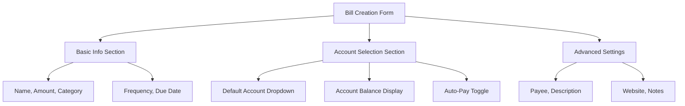
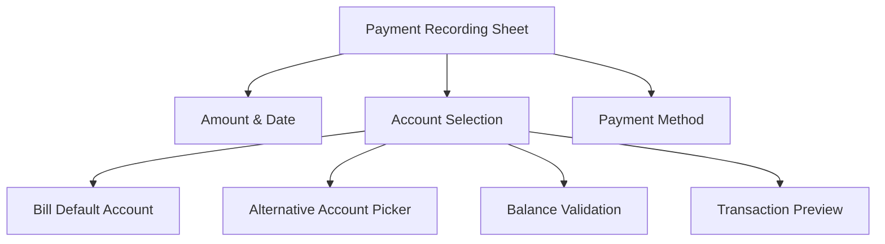
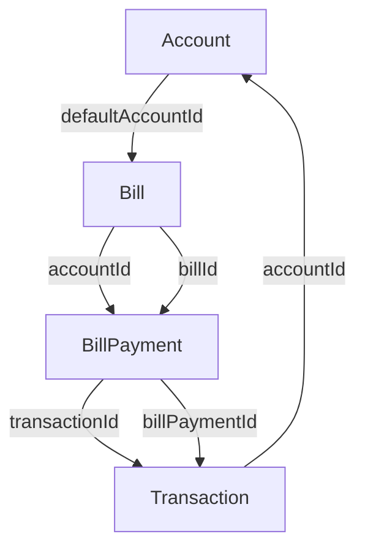
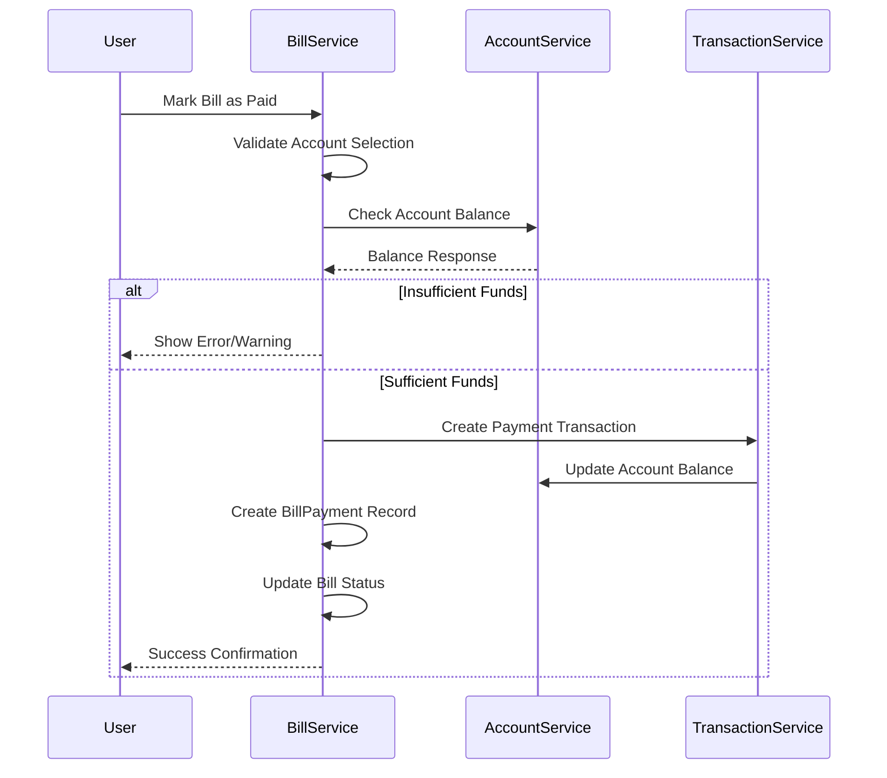
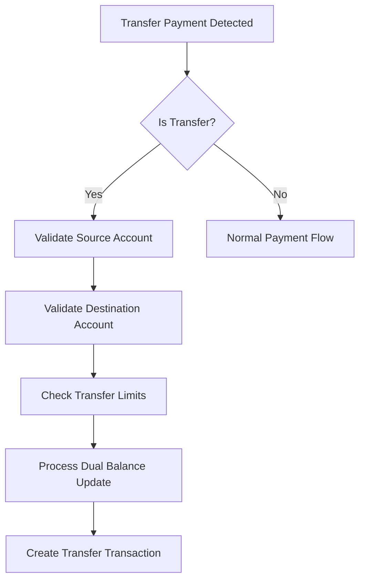

# Account Selection Integration Design for Bills

## Executive Summary

This design document outlines a comprehensive account selection integration for the bills feature, following the Account-Transaction-Relationship.md principles. The current implementation has basic account support in the Bill entity but lacks UI integration and comprehensive relationship management. This design enhances the system to provide accurate financial tracking, improved UX, and data integrity.

## Current State Analysis

### Existing Implementation
- **Bill Entity**: Has `accountId` field but not utilized in UI
- **UI Screens**: Bill creation and payment recording lack account selection
- **Relationships**: Basic account-bill linkage exists but not leveraged
- **Transactions**: Account balance updates work for regular transactions

### Gaps Identified
1. No account selection in bill creation/editing/payment UI
2. No default account assignment for bills
3. No bill payment transaction creation
4. No balance validation for bill payments
5. No migration path for existing bills

## 1. UI/UX Design for Account Selection

### A. Bill Creation Screen Enhancement



**Account Selection UI Components:**

1. **Smart Account Dropdown**
   - Shows all active accounts with balances
   - Displays account type icons and colors
   - Shows available balance for spending accounts
   - Highlights recommended accounts based on bill category

2. **Account Balance Preview**
   - Real-time balance display
   - Color-coded balance status (positive/negative)
   - Available credit for credit cards
   - Insufficient funds warning

3. **Auto-Pay Integration**
   - Toggle for automatic payments
   - Account validation for auto-pay eligibility
   - Warning for accounts with low balances

### B. Bill Editing Screen

**Same account selection components as creation, plus:**
- Current account display with change option
- Migration warning if changing accounts
- Payment history consideration

### C. Payment Recording Enhancement



**Payment Recording Features:**
1. **Default Account Pre-selection**: Uses bill's default account
2. **Account Override**: Allow selection of different account
3. **Balance Validation**: Real-time insufficient funds check
4. **Transaction Preview**: Shows resulting account balance

## 2. Data Flow Architecture

### Core Relationship Model



### Enhanced Bill Entity

```dart
@freezed
class Bill with _$Bill {
  // ... existing fields ...

  // ═══ ACCOUNT RELATIONSHIP ═══
  String? defaultAccountId,  // Primary account for payments
  List<String>? allowedAccountIds,  // Alternative accounts

  // ═══ PAYMENT TRACKING ═══
  List<BillPayment> paymentHistory,

  // ═══ AUTO-PAY SETTINGS ═══
  bool isAutoPay,
  DateTime? autoPayDate,
  double? autoPayBuffer,  // Minimum balance required
}
```

### Bill Payment Flow



## 3. Validation and Error Handling

### Account Selection Validation

```dart
class BillValidationService {
  Result<void> validateAccountSelection({
    required String? accountId,
    required Bill bill,
    required List<Account> availableAccounts,
  }) {
    // 1. Account exists check
    if (accountId != null) {
      final account = availableAccounts.firstWhereOrNull(
        (acc) => acc.id == accountId
      );
      if (account == null) {
        return Result.error(Failure.validation(
          'Selected account no longer exists',
          {'accountId': 'Invalid account selection'}
        ));
      }

      // 2. Account active check
      if (!account.isActive) {
        return Result.error(Failure.validation(
          'Selected account is inactive',
          {'accountId': 'Account not available'}
        ));
      }

      // 3. Balance sufficiency for immediate payments
      if (bill.amount > account.availableBalance) {
        return Result.warning(
          'Account has insufficient balance for this bill amount',
          {'balance': 'Insufficient funds warning'}
        );
      }
    }

    return Result.success(null);
  }
}
```

### Payment Processing Validation

```dart
class BillPaymentValidation {
  Result<BillPayment> validatePayment({
    required Bill bill,
    required BillPayment payment,
    required Account account,
  }) {
    // Amount validation
    if (payment.amount <= 0) {
      return Result.error(Failure.validation(
        'Payment amount must be positive',
        {'amount': 'Invalid amount'}
      ));
    }

    // Account balance check
    if (payment.amount > account.availableBalance) {
      return Result.error(Failure.validation(
        'Insufficient account balance',
        {'balance': 'Insufficient funds'}
      ));
    }

    // Payment date validation
    if (payment.paymentDate.isAfter(DateTime.now().add(const Duration(days: 1)))) {
      return Result.error(Failure.validation(
        'Payment date cannot be in the future',
        {'paymentDate': 'Invalid date'}
      ));
    }

    return Result.success(payment);
  }
}
```

## 4. Balance Update Mechanisms

### Eager Balance Updates

```dart
class BillPaymentProcessor {
  Future<Result<BillPayment>> processPayment({
    required Bill bill,
    required BillPayment payment,
    required Account account,
  }) async {
    // 1. Start transaction
    final transactionResult = await _transactionRepository.startTransaction();

    try {
      // 2. Create expense transaction
      final expenseTransaction = Transaction(
        id: _generateId(),
        amount: payment.amount,
        type: TransactionType.expense,
        accountId: account.id,
        categoryId: bill.categoryId,
        description: 'Bill Payment: ${bill.name}',
        billPaymentId: payment.id,
        date: payment.paymentDate,
      );

      final txResult = await _transactionRepository.add(expenseTransaction);
      if (txResult.isError) throw txResult.failure!;

      // 3. Update account balance immediately
      final updatedAccount = account.copyWith(
        cachedBalance: account.currentBalance - payment.amount,
        lastBalanceUpdate: DateTime.now(),
      );

      final accountResult = await _accountRepository.update(updatedAccount);
      if (accountResult.isError) throw accountResult.failure!;

      // 4. Create bill payment record
      final billPayment = payment.copyWith(
        transactionId: expenseTransaction.id,
      );

      final paymentResult = await _billRepository.addPayment(bill.id, billPayment);
      if (paymentResult.isError) throw paymentResult.failure!;

      // 5. Update bill status
      final updatedBill = bill.copyWith(
        lastPaidDate: payment.paymentDate,
        nextDueDate: _calculateNextDueDate(bill),
        paymentHistory: [...bill.paymentHistory, billPayment],
      );

      await _billRepository.update(updatedBill);

      // 6. Commit transaction
      await _transactionRepository.commit();

      return Result.success(billPayment);

    } catch (e) {
      // Rollback on failure
      await _transactionRepository.rollback();
      return Result.error(Failure.unknown('Payment processing failed: $e'));
    }
  }
}
```

### Reconciliation Support

```dart
class AccountReconciliationService {
  Future<Result<void>> reconcileAccount(String accountId) async {
    // 1. Get all transactions for account
    final transactions = await _transactionRepository.getByAccountId(accountId);

    // 2. Calculate expected balance from transactions
    final calculatedBalance = _calculateBalanceFromTransactions(transactions);

    // 3. Get current account balance
    final account = await _accountRepository.getById(accountId);

    // 4. Compare and update if needed
    if ((account.cachedBalance - calculatedBalance).abs() > 0.01) {
      final reconciledAccount = account.copyWith(
        cachedBalance: calculatedBalance,
        reconciledBalance: calculatedBalance,
        lastReconciliation: DateTime.now(),
      );

      await _accountRepository.update(reconciledAccount);
    }

    return Result.success(null);
  }
}
```

## 5. Edge Case Handling

### A. Transfer Payments



**Transfer Payment Logic:**
```dart
Future<Result<void>> processTransferPayment({
  required Bill bill,
  required BillPayment payment,
  required Account sourceAccount,
  required Account destAccount,
}) async {
  // Validate transfer accounts
  if (sourceAccount.id == destAccount.id) {
    return Result.error(Failure.validation('Cannot transfer to same account'));
  }

  // Check transfer amount limits
  if (payment.amount > sourceAccount.availableBalance) {
    return Result.error(Failure.validation('Insufficient source balance'));
  }

  // Process as transfer transaction
  final transferTx = Transaction(
    amount: payment.amount,
    type: TransactionType.transfer,
    accountId: sourceAccount.id,
    toAccountId: destAccount.id,
    // ... other fields
  );

  // Update both account balances
  await _updateTransferBalances(sourceAccount, destAccount, payment.amount);
}
```

### B. Multiple Account Bills

```dart
class MultiAccountBillHandler {
  Future<Result<Account>> selectOptimalAccount({
    required Bill bill,
    required List<Account> availableAccounts,
  }) async {
    // 1. Filter eligible accounts
    final eligibleAccounts = availableAccounts.where((account) {
      return account.isActive &&
             account.availableBalance >= bill.amount &&
             _isAccountTypeSuitable(account, bill);
    }).toList();

    if (eligibleAccounts.isEmpty) {
      return Result.error(Failure.validation('No suitable accounts available'));
    }

    // 2. Score accounts by preference
    final scoredAccounts = eligibleAccounts.map((account) {
      return _scoreAccount(account, bill);
    }).toList();

    scoredAccounts.sort((a, b) => b.score.compareTo(a.score));

    return Result.success(scoredAccounts.first.account);
  }

  AccountScore _scoreAccount(Account account, Bill bill) {
    double score = 0;

    // Prefer default account
    if (account.id == bill.defaultAccountId) score += 10;

    // Prefer accounts with higher balances
    score += (account.availableBalance / bill.amount) * 5;

    // Prefer checking/savings over credit cards for bills
    if (account.type == AccountType.bankAccount) score += 3;

    // Prefer accounts with recent activity
    if (account.lastBalanceUpdate != null) {
      final daysSinceUpdate = DateTime.now().difference(account.lastBalanceUpdate!).inDays;
      score += math.max(0, 5 - daysSinceUpdate);
    }

    return AccountScore(account, score);
  }
}
```

### C. Insufficient Funds Scenarios

```dart
class InsufficientFundsHandler {
  Future<Result<PaymentRecommendation>> handleInsufficientFunds({
    required Bill bill,
    required Account account,
    required double requiredAmount,
  }) async {
    final shortfall = requiredAmount - account.availableBalance;

    // 1. Check for alternative accounts
    final alternativeAccounts = await _findAlternativeAccounts(bill, requiredAmount);

    if (alternativeAccounts.isNotEmpty) {
      return Result.success(PaymentRecommendation.alternativeAccount(
        alternativeAccounts.first,
        'Use ${alternativeAccounts.first.displayName} instead'
      ));
    }

    // 2. Suggest partial payment
    if (account.availableBalance > 0) {
      return Result.success(PaymentRecommendation.partialPayment(
        account.availableBalance,
        'Pay available balance of \$${account.availableBalance.toStringAsFixed(2)}'
      ));
    }

    // 3. Suggest adding funds
    return Result.success(PaymentRecommendation.addFunds(
      shortfall,
      'Add \$${shortfall.toStringAsFixed(2)} to ${account.displayName}'
    ));
  }
}
```

## 6. Migration Strategy

### Phase 1: Data Migration

```dart
class BillAccountMigrationService {
  Future<Result<void>> migrateExistingBills() async {
    // 1. Get all bills without accounts
    final bills = await _billRepository.getAll();
    final billsWithoutAccounts = bills.where((bill) => bill.accountId == null);

    // 2. Get all available accounts
    final accounts = await _accountRepository.getAll();

    // 3. Apply migration logic
    for (final bill in billsWithoutAccounts) {
      final suggestedAccount = await _suggestAccountForBill(bill, accounts);

      if (suggestedAccount != null) {
        // Update bill with suggested account
        final updatedBill = bill.copyWith(
          accountId: suggestedAccount.id,
          migrationNotes: 'Auto-assigned during account integration migration',
        );

        await _billRepository.update(updatedBill);
      }
    }

    return Result.success(null);
  }

  Future<Account?> _suggestAccountForBill(Bill bill, List<Account> accounts) async {
    // 1. Try to match by bill category and account usage patterns
    final categoryMatches = accounts.where((account) {
      return _hasCategoryTransactions(account.id, bill.categoryId);
    });

    if (categoryMatches.isNotEmpty) {
      return categoryMatches.first;
    }

    // 2. Fallback to primary checking account
    final checkingAccounts = accounts.where(
      (account) => account.type == AccountType.bankAccount
    );

    return checkingAccounts.firstOrNull;
  }
}
```

### Phase 2: UI Migration

```dart
class MigrationUIHandler {
  void showMigrationPrompt(BuildContext context, List<Bill> billsNeedingAccounts) {
    if (billsNeedingAccounts.isEmpty) return;

    showDialog(
      context: context,
      builder: (context) => AlertDialog(
        title: const Text('Account Integration Available'),
        content: Text(
          '${billsNeedingAccounts.length} bills need account assignment for better tracking.'
        ),
        actions: [
          TextButton(
            onPressed: () => Navigator.pop(context),
            child: const Text('Later'),
          ),
          ElevatedButton(
            onPressed: () => _startMigrationFlow(context, billsNeedingAccounts),
            child: const Text('Set Up Accounts'),
          ),
        ],
      ),
    );
  }

  void _startMigrationFlow(BuildContext context, List<Bill> bills) {
    // Navigate to migration wizard
    Navigator.push(
      context,
      MaterialPageRoute(
        builder: (context) => BillAccountMigrationWizard(bills: bills),
      ),
    );
  }
}
```

## 7. Testing Approach

### A. Unit Testing Strategy

```dart
class BillAccountIntegrationTests {
  group('Account Selection Validation', () {
    test('should validate account exists', () async {
      // Arrange
      final bill = Bill(id: '1', name: 'Test', amount: 100, ...);
      final accounts = [Account(id: '1', name: 'Checking', ...)];

      // Act
      final result = await validationService.validateAccountSelection(
        accountId: 'nonexistent',
        bill: bill,
        availableAccounts: accounts,
      );

      // Assert
      expect(result.isError, true);
      expect(result.failure!.message, contains('account no longer exists'));
    });

    test('should validate sufficient balance', () async {
      // Arrange
      final account = Account(id: '1', cachedBalance: 50, ...);
      final bill = Bill(amount: 100, ...);

      // Act
      final result = await validationService.validateAccountSelection(
        accountId: account.id,
        bill: bill,
        availableAccounts: [account],
      );

      // Assert
      expect(result.isSuccess, true); // Warning, not error
      expect(result.warning!.message, contains('insufficient balance'));
    });
  });

  group('Balance Update Integration', () {
    test('should update account balance on bill payment', () async {
      // Arrange
      final account = Account(id: '1', cachedBalance: 1000, ...);
      final bill = Bill(id: '1', amount: 100, ...);
      final payment = BillPayment(amount: 100, ...);

      // Act
      await paymentProcessor.processPayment(
        bill: bill,
        payment: payment,
        account: account,
      );

      // Assert
      final updatedAccount = await accountRepository.getById('1');
      expect(updatedAccount.cachedBalance, 900);
    });

    test('should rollback on payment failure', () async {
      // Arrange - Mock repository to fail
      when(accountRepository.update(any)).thenReturn(Result.error(Failure.cache('DB error')));

      // Act
      final result = await paymentProcessor.processPayment(...);

      // Assert
      expect(result.isError, true);
      // Verify balances unchanged
    });
  });
}
```

### B. Integration Testing

```dart
class BillPaymentIntegrationTests {
  group('End-to-End Payment Flow', () {
    test('should complete full payment cycle', () async {
      // 1. Create account with balance
      final account = await createTestAccount(balance: 1000);

      // 2. Create bill
      final bill = await createTestBill(amount: 100, accountId: account.id);

      // 3. Process payment
      final payment = BillPayment(amount: 100, paymentDate: DateTime.now());
      final result = await billService.markBillAsPaid(bill.id, payment);

      // 4. Verify all states updated
      expect(result.isSuccess, true);

      // Check account balance updated
      final updatedAccount = await accountRepository.getById(account.id);
      expect(updatedAccount.cachedBalance, 900);

      // Check transaction created
      final transactions = await transactionRepository.getByAccountId(account.id);
      expect(transactions.length, 1);
      expect(transactions.first.amount, 100);
      expect(transactions.first.type, TransactionType.expense);

      // Check bill payment recorded
      final updatedBill = await billRepository.getById(bill.id);
      expect(updatedBill.paymentHistory.length, 1);
      expect(updatedBill.lastPaidDate, payment.paymentDate);
    });
  });
}
```

### C. Data Consistency Testing

```dart
class DataConsistencyTests {
  test('should maintain balance consistency across all operations', () async {
    // 1. Setup initial state
    final account = await createTestAccount(balance: 1000);
    final initialBalance = account.cachedBalance;

    // 2. Perform multiple bill payments
    final bills = await createTestBills(count: 5, amount: 100);
    for (final bill in bills) {
      await processBillPayment(bill, account);
    }

    // 3. Verify final balance
    final finalAccount = await accountRepository.getById(account.id);
    final expectedBalance = initialBalance - (5 * 100);

    expect(finalAccount.cachedBalance, expectedBalance);

    // 4. Verify through reconciliation
    await reconciliationService.reconcileAccount(account.id);
    final reconciledAccount = await accountRepository.getById(account.id);

    expect(reconciledAccount.cachedBalance, expectedBalance);
    expect(reconciledAccount.reconciledBalance, expectedBalance);
  });
}
```

## Implementation Roadmap

### Phase 1: Foundation (Week 1-2)
1. Update Bill entity with enhanced account fields
2. Create account selection UI components
3. Implement basic account validation

### Phase 2: Core Integration (Week 3-4)
1. Implement payment processing with balance updates
2. Add transaction creation for bill payments
3. Create bill payment history tracking

### Phase 3: Advanced Features (Week 5-6)
1. Multi-account support and smart selection
2. Auto-pay integration
3. Edge case handling (transfers, insufficient funds)

### Phase 4: Migration & Polish (Week 7-8)
1. Migration system for existing bills
2. UI enhancements and error handling
3. Comprehensive testing and validation

## Success Metrics

- **Data Integrity**: 100% balance consistency across operations
- **User Experience**: Account selection in <3 clicks
- **Error Rate**: <1% failed payment attempts
- **Migration Success**: 95% existing bills successfully migrated
- **Test Coverage**: >90% for account-bill integration code

This design provides a robust, user-friendly account selection system that maintains data integrity while improving the bill management experience.